# DirectX12 Physically-Based Renderer Running on My Sad Ass RTX A3000
A physics-based GPU path tracer I built for CS5630 (Physically-Based Rendering) at Cornell, the first-ever offering of the class ([more on PBR here](https://pbrt.org/)). More accurately, I primarily wrote the math-heavy logic (hair, volumetrics, etc.) on CPU during the school semester, then in my free time during my summer internship as as a systems software engineering intern at [LinkedIn](https://www.linkedin.com/blog/engineering)  I extended this project to run primarily on GPU.

Every ray bounce, material evaluation, and light sample runs entirely on the GPU via DirectX Raytracing (DXR) with hardware-accelerated ray-triangle intersection. With the techniques implemented here (hair/fiber rendering, skin, the Disney BSDF, and more) you can build a diverse, complicated, beautiful scene with physically-accurate lighting.

1. I render a final scene of a "self-portrait" surrounded by nerdy objects I like. This scene contains roughly 2.5 million triangles, 100+ meshes, 100+ distinct textures.
2. In terms of perf benchmarking, it is able to render 10+ million triangles

3. Quite a few other interesting scenes are to come...

---

## Contents

- [Final Render (CS5630 Rendering Competition)](#final-render-that-i-submitted-for-cs5630-rendering-competition)
- [Architecture](#architecture)
- [Rendering Techniques](#rendering-techniques)
  - [Hair (Chiang et al. 2016 BCSDF)](#hair-chiang-et-al-2016-bcsdf)
  - [Disney "Principled" BRDF](#disney-principled-brdf)
  - [Volumetric Participating Media](#volumetric-participating-media)
  - [Textures](#textures)
  - [Normal Mapping](#normal-mapping)
  - [Depth of Field (Thin Lens Model)](#depth-of-field-thin-lens-model)
  - [Image-Based Lighting (IBL)](#image-based-lighting-ibl)
- [Performance & Optimization](#performance--optimization)
  - [Megakernel vs wavefront](#megakernel-vs-wavefront)
  - [Measurement setup](#measurement-setup)
  - [The bottleneck](#the-bottleneck)
  - [Measured optimizations](#measured-optimizations)
  - [Next](#next)

---

## Final Render That I Submitted for CS5630 Rendering Competition

The scene was assembled in Blender (about 100 hours in a piece of software I did not know going in), exported mesh by mesh with all world-space transforms baked in, and post-processed with Intel's open-source denoiser.

In terms of the Blender scene assembly, I had some help scanning my face and reconstructing it as a mesh with clean geometry. It looks good, right? And then, I modelled so many small objects in Blender, or took them off of SketchFab and moved them to their respective coordinates in Blender. Consider this a glorified art project. See if you can spot any references (e.g., how many Miku's can you spot?)

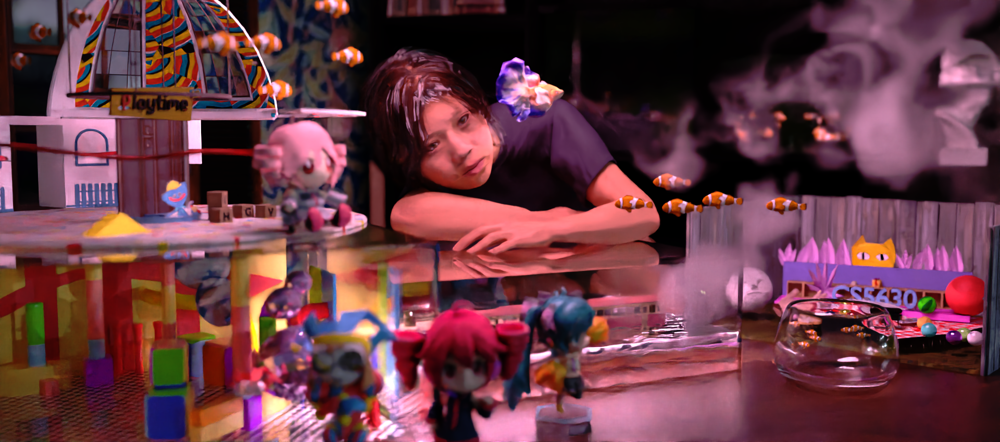

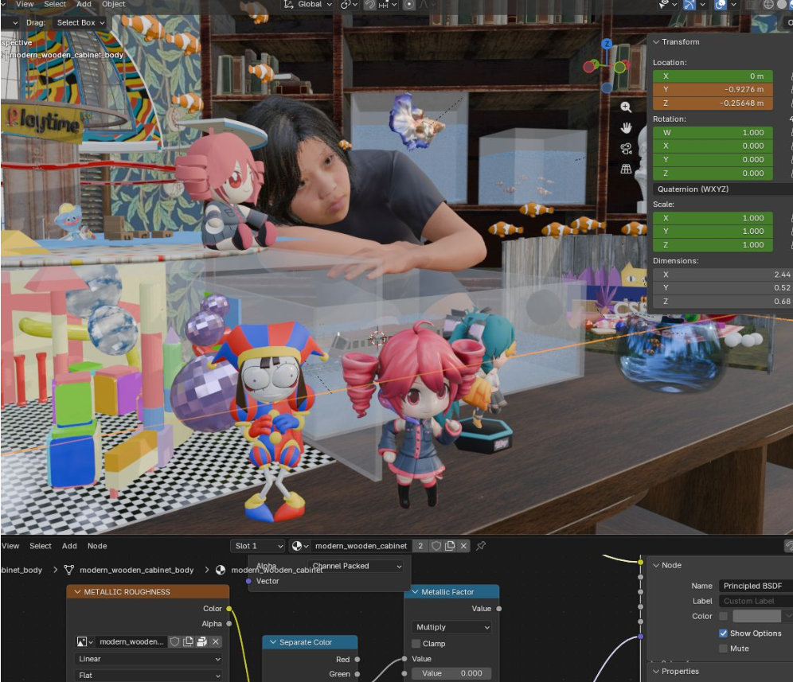

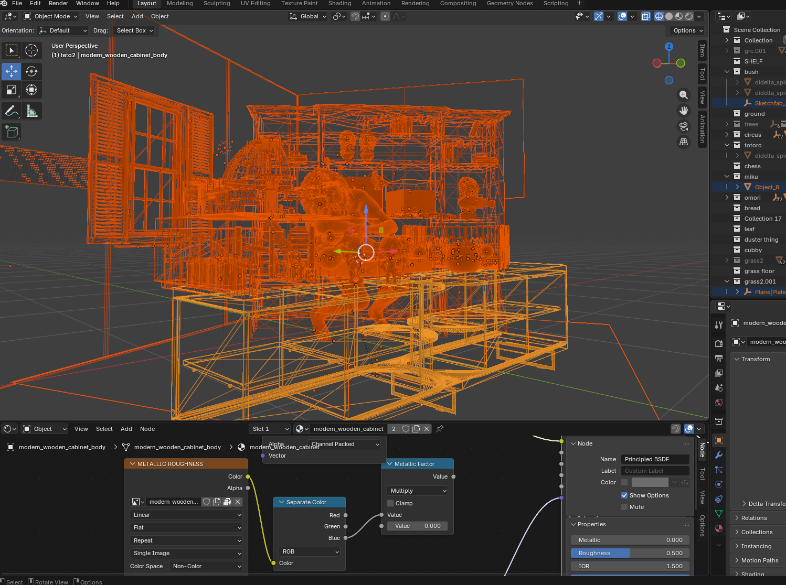

---

## Architecture

The whole pipeline (shooting rays, finding intersections, all the beautiful shading math, shadow testing) is implemented in HLSL and dispatched through DXR. Here are some interesting design decisions (in my opinion):

**All textures in one array.** Every texture in the scene is loaded into a single unbounded GPU array. Each material stores small integer indices pointing into that array, so any shader invocation can reach any texture with a single indexed sample. 50+ textures can coexist without any special-casing.

**Geometry in flat GPU buffers.** UVs, normals, and tangents for every mesh are concatenated into large flat buffers at scene build time. When a ray hits a triangle, DXR gives the shader an instance ID and primitive index, which it uses to look up the right three vertices and interpolate the attributes at the hit point, without any per-mesh binding.

**Mip levels from hit distance.** Without a proper ray differential framework, mip level is approximated from the hit distance and the screen resolution. It's not perfect, but it avoids obvious aliasing on surfaces seen at a glancing angle.

**Stochastic alpha for hair and eyelashes.** Alpha-textured meshes (hair cards, eyelashes, eyebrows) are marked as non-opaque in the acceleration structure. This tells DXR to call a small any-hit shader on each candidate intersection rather than accepting it automatically. The shader samples the alpha texture and probabilistically accepts or discards the hit (using α² rather than α, since alpha maps from most DCC tools are perceptually encoded). This applies to both primary rays and shadow rays, so strand silhouettes cut out in shadows too.

**Intel OIDN at the end.** The raw HDR framebuffer goes through Intel Open Image Denoiser before tone-mapping.

---

## Rendering Techniques

### Hair (Chiang et al. 2016 BCSDF)

Rendering hair is hard, both in terms of performance and visual accuracy. This is because a single fiber is a translucent dielectric cylinder, so light can reflect off the outside, transmit straight through, bounce internally, or some combination. Now imagine thousands of these.

I implemented the Chiang 2016 model, which breaks this down into four scattering paths:

| Path | Description |
|---|---|
| **R** | Reflects off the outer cuticle surface |
| **TT** | Transmits in through one side and out the other |
| **TRT** | Transmits in, bounces off the inside, transmits back out |
| **residual** | Everything with 3 or more internal bounces, summed analytically as a geometric series |

Each path is attenuated by Fresnel reflectance at each interface and Beer-law absorption through the fiber interior:

$$T = \exp\!\left(-\sigma_a \cdot \frac{2\cos\gamma_t}{\cos\theta_t}\right)$$

where $\sigma_a$ is the absorption coefficient, derived from the target hair color via a polynomial fit: you specify color directly, not raw absorption values. The four attenuation values work out to:

```hlsl
ap[0] = f;                          // R:  one Fresnel reflection
ap[1] = (1-f)*(1-f) * T;           // TT: transmit in, absorb, transmit out
ap[2] = ap[1] * T * f;             // TRT: TT path + internal bounce + T again
ap[3] = ap[2] * f*T / (1 - f*T);   // residual: geometric series for p>=3
```

The full scattering function factors into longitudinal ($M_p$), attenuation ($A_p$), and azimuthal ($N_p$) terms. Importance sampling picks a path by luminance weight, draws a longitude direction from the $M_p$ distribution, and an azimuth from a trimmed logistic distribution.

**Hair cards** are supported!: flat quad meshes textured with a grayscale strand atlas, made transparent via the alpha any-hit shader described above.

| Hair View 1 | Hair View 2 |
|---|---|
| 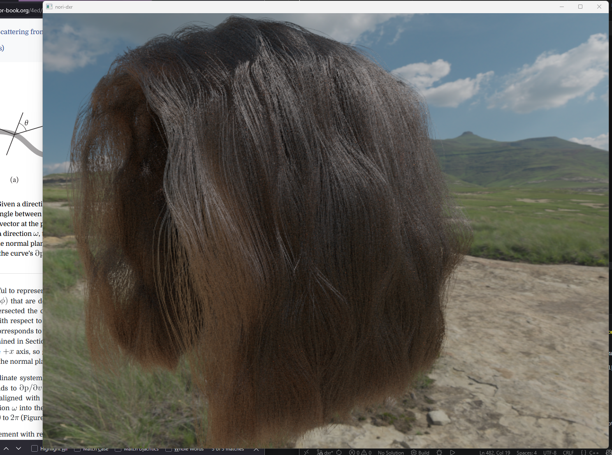 | 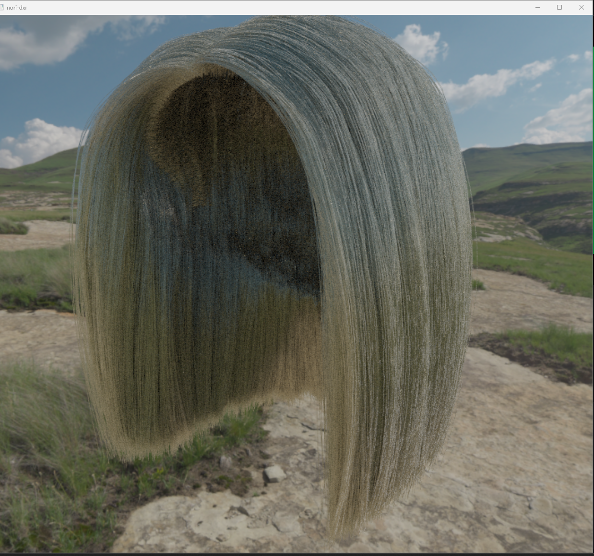 |

---

### Disney "Principled" BRDF

The Disney BRDF (Burley 2012) is the material model used in most production renderers and game engines. It wraps five physically-motivated scattering lobes into one material with artist-friendly parameters (`metallic`, `roughness`, `subsurface`, `sheen`, `clearcoat`, etc.) instead of raw physical coefficients.

The five lobes, with $\omega_i$ and $\omega_o$ being the incident and outgoing directions and $\mathbf{h} = \text{normalize}(\omega_i + \omega_o)$ the half-vector:

| Lobe | Formula | What it does |
|---|---|---|
| **Burley diffuse** | $\frac{c}{\pi}(1+(F_{D90}-1)(1-\cos\theta_i)^5)(1+(F_{D90}-1)(1-\cos\theta_o)^5)$ | Rough diffuse with retroreflection at grazing angles |
| **Hanrahan-Krueger subsurface** | $\frac{1.25c}{\pi}\left(F_{ss,i} F_{ss,o}\left(\frac{1}{\cos\theta_i+\cos\theta_o} - 0.5\right) + 0.5\right)$ | Flat-slab subsurface approximation; softens the shadow terminator |
| **GGX specular** | $\frac{D_\text{GGX}\, F_\text{Schlick}\, G_\text{Smith}}{4\cos\theta_i\cos\theta_o}$ | Microfacet specular highlight |
| **Sheen** | $\kappa_\text{sheen}\, C_\text{sheen}\, (1-\cos\theta_D)^5$ | Grazing-angle brightening for cloth/fabric |
| **Clearcoat** | $\frac{0.25\, k_{cc}\, D_\text{GTR1}\, F_{0.04}\, G_{0.25}}{4\cos\theta_i\cos\theta_o}$ | Thin dielectric layer on top, like the coating on car paint or glossy plastic |

The combined BRDF is $f = (1-\text{metallic})\,f_\text{diffuse} + f_\text{specular} + f_\text{sheen} + f_\text{clearcoat}$. Setting `metallic=1` zeroes out the diffuse and tints the specular by `baseColor`, making a conductor. For sampling, a lobe is chosen weighted by its estimated contribution, then a direction is drawn from that lobe's distribution.

| Metallic | Clearcoat | Sheen |
|---|---|---|
| 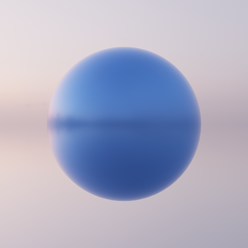 | 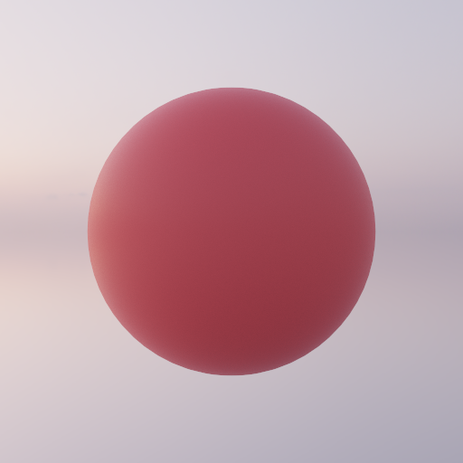 | 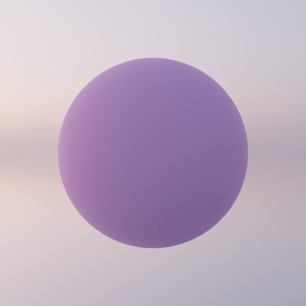 |

---

### Volumetric Participating Media

Volumetrics are objects that are not solid, and they are another rendering challenge mathematically, accurately, performance-wise, whatever. Fog, smoke, and clouds scatter or absorb light as rays travel through them, not just at surfaces. A homogeneous medium has three parameters: absorption $\sigma_a$, scattering $\sigma_s$, and an asymmetry parameter $g$ that controls how directional the scattering is.

The probability that a ray makes it distance $d$ without interacting follows Beer's law:

$$T(d) = \exp(-\sigma_t\, d), \quad \sigma_t = \sigma_a + \sigma_s$$

When a scatter event does happen, the new direction is drawn from the **Henyey-Greenstein phase function**:

$$f_p(\cos\theta) = \frac{1-g^2}{4\pi\,(1 + g^2 - 2g\cos\theta)^{3/2}}$$

$g=0$ is isotropic (scatter equally in all directions); $g \to 1$ concentrates light forward, like thin aerosols or clouds in sunlight. This function is analytically invertible, so importance sampling is exact.

Free-flight distances are sampled via **Woodcock (null-collision) tracking**: propose a step under an overestimate of the density, then randomly decide if it's a real collision or a null one. This also extends cleanly to heterogeneous media since you only need an upper bound on the density, not the exact value everywhere.

| g = 0 (isotropic) | g = 0.3 | g = 0.8 (forward) |
|---|---|---|
| 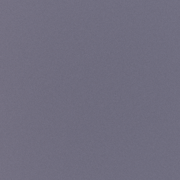 | 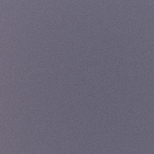 | 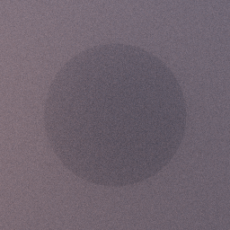 |

---

### Textures

At the hit point, the shader computes the UV by barycentrically interpolating the three vertex UVs of the struck triangle. Albedo textures decode sRGB automatically (the hardware handles the gamma); normal and roughness maps are loaded as linear data. The sampled value then replaces the material's flat scalar before the BSDF runs.

| With texture | Without texture |
|---|---|
| 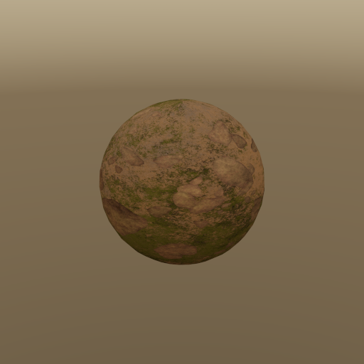 | 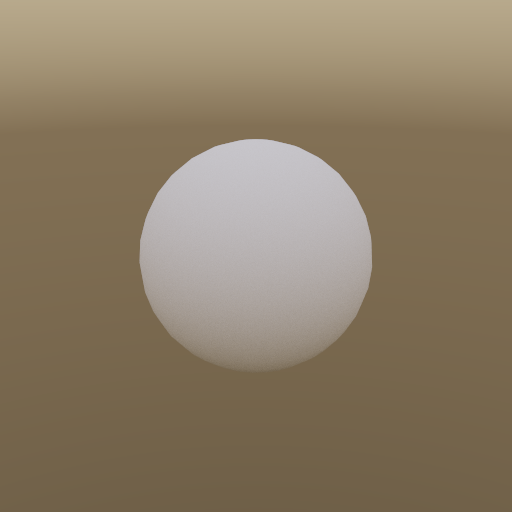 |

---

### Normal Mapping

Normal mapping makes a flat polygon look like it has surface detail by perturbing the shading normal at each hit point using a texture that stores tangent-space normals.

To do this, the shader reconstructs a per-triangle tangent frame from the UV layout. Given the three edge vectors and UV differences of the hit triangle, the tangent direction is:

$$\mathbf{T} = \frac{\Delta v_2 \, \mathbf{e}_1 - \Delta v_1 \, \mathbf{e}_2}{\Delta u_1 \Delta v_2 - \Delta u_2 \Delta v_1}$$

This gets orthogonalized against the interpolated vertex normal $\mathbf{N}$ (Gram-Schmidt), and the bitangent follows as $\mathbf{B} = \mathbf{N} \times \mathbf{T}$. The RGB value from the normal map is then mapped from $[0,1]^3$ to $[-1,1]^3$ and rotated into world space:

$$\mathbf{N'} = \text{normalize}(\mathbf{T} n_x + \mathbf{B} n_y + \mathbf{N} n_z)$$

| With Normal Map | Without |
|---|---|
| 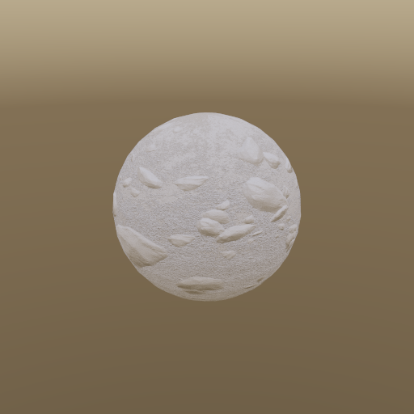 |  |

---

### Depth of Field (Thin Lens Model)

A pinhole camera is sharp everywhere. A real lens has a finite aperture, so anything off the focal plane blurs into a **circle of confusion** whose radius scales with how out of focus it is:

$$r_\text{CoC} = r \cdot \frac{|z - d_f|}{z}$$

where $r$ is the lens radius and $d_f$ is the focal distance. To simulate this, each primary ray is generated in two steps: first find where the pinhole ray would hit the focal plane (the focus point), then randomly offset the ray origin across the aperture disk while keeping the ray aimed at that same focus point. The aperture is sampled with a uniform disk distribution (concentric mapping to avoid bunching at the center).

| r = 0 (pinhole) | r = 0.05 | r = 0.15 |
|---|---|---|
| 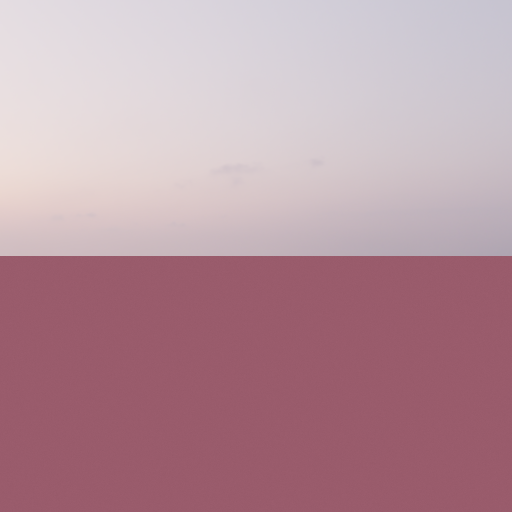 |  | 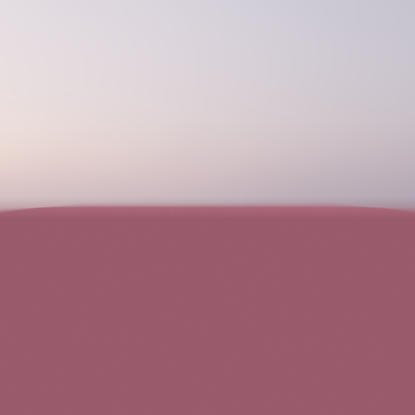 |

The subject (red cube) stays sharp while the background blurs more as the aperture opens up.

---

### Image-Based Lighting (IBL)

Rather than placing explicit lights, a scene can be lit by an HDR panorama (or a combination of lights + ibl. Also IBL is a good hack for getting non-grainy scenes because it has less high-variance sampling!) Rays that miss all geometry look up their direction in the panorama and return that radiance.

In sampling IBL, a uniform random direction wastes most samples on the dark sky, so at load time we build a 2D CDF over the image pixels, with each pixel weighted by its luminance times $\sin\theta$ (to correct for equirectangular pixels covering less solid angle near the poles). At render time, two binary searches pick a row then a column, sampling directions proportional to their brightness. The resulting solid-angle PDF is:

$$p_\omega = p_\text{pixel} \cdot \frac{W \cdot H}{2\pi^2 \sin\theta}$$

Environment samples are combined with BSDF samples using MIS.

| Diffuse sphere | Mirror sphere |
|---|---|
| 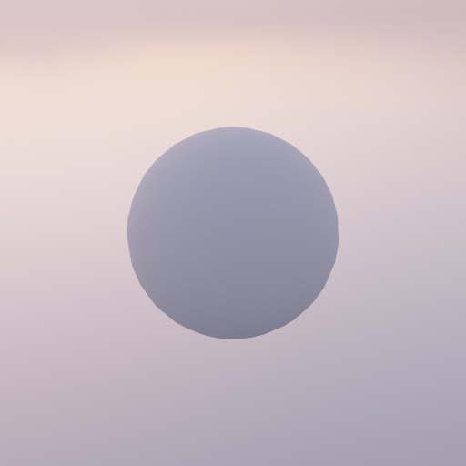 | 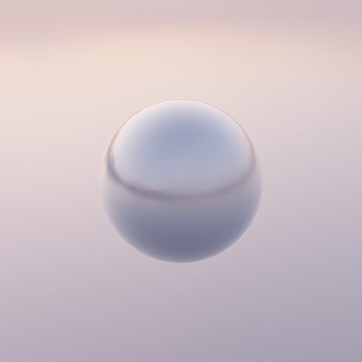 |

---

## Performance & Optimization

The renderer is a **megakernel path tracer**: the whole bounce loop, every BSDF above, next-event estimation with MIS, and the volume tracking all run inline in one `RayGen()` shader. It's a progressive accumulator, so each frame adds one sample per pixel and the image refines over time. All development and profiling was on a **mobile RTX A3000**, which throttles and crashes under sustained load, so this section leans on cheap measurements rather than heavy reference renders.

### Megakernel vs wavefront

The alternative to a megakernel is a **wavefront** tracer that splits the work into separate generation, intersection, shading, and shadow passes and sorts rays by material between bounces. That's the design "Megakernels Considered Harmful" (Laine, Karras, Aila 2013) argues for, and it's what PBRT's GPU backend uses; it gets higher throughput on big scenes because sorting restores coherence and each small pass hits higher occupancy.

The tradeoff is that a wavefront tracer spills path state to global memory between passes and turns every new material into a scheduling problem. The megakernel keeps path state in registers across bounces and keeps the whole renderer in one shader, which made adding hair, then Disney, then volumes, then subsurface scattering cheap. For my renderer that outputs an accumulated, denoised final (not a 1-spp real-time frame), this iterative design choice was ok. 

### Measurement setup

Two properties make measurement cheap. The renderer is **byte-for-byte deterministic** (the RNG is seeded only from the frame counter), so any render-identical change is verified by hashing the output EXR instead of eyeballing it. And because it's a progressive accumulator, every frame is ~1 spp of identical work, so per-frame `DispatchRays` GPU time is the per-sample metric, captured with a `TIMESTAMP` query heap behind a `--profile` flag. That matters because wall-clock is misleading: on a 64-spp material scene wall-clock reads **114.8 ms/spp** but the pure GPU dispatch is **88.0 ms**, so ~23% of "render time" is CPU/present/fence overhead. Frame-to-frame spread is ~0.4%, so min-of-N GPU time is a stable A/B reference.

### The bottleneck

Nsight on the primary DirectX `DispatchRays` call:

| Metric | Value | Meaning |
|---|---|---|
| SM warp occupancy | ~27% | about two-thirds of warp slots idle |
| Active threads per warp | ~7 of 32 (~22%) | heavy **divergence** |
| SM vs RT-core throughput | 46% vs 23% | **shading-bound**, not intersection-bound |

The kernel is bound by **divergence and latency** ( who would have known) not by ray tracing: pixels in a warp take different BSDFs, bounce counts, and lights, so the lanes can't stay in lockstep. To check whether register pressure from inlining every material was the cause, I wrote some compile guards that produce a stripped kernel that is **63% smaller** (92,580 → 34,412 bytes) but rendered benchmark scenes bit-identical. Occupancy did **not** rise: **26.7% full → 14.1% stripped**. So it is not register-bound, and per-scene specialization was dropped. The real fix is structural (a wavefront rewrite), which I will build next...

### Measured optimizations

| Change | Before → After | Result |
|---|---|---|
| **Ray payload** shrink | 80 B → 28 B | ~5–10% faster on the hair scene, bit-identical output |
| **Owen-Sobol sampler** (vs PCG white noise) | — | lower variance per sample; unbiased (64-spp means match to 0.01%) |
| **64-spp + OIDN** vs 2048-spp reference | relMSE 0.182 → 0.006 | ~30× lower error, near-reference quality at a fraction of the GPU time |

**Ray payload.** The per-ray payload originally carried the geometric normal, environment radiance, shading normal, UV, tangent, and a hair parameter. Most of that is recomputable from what DXR already returns, so the payload now ships two barycentric floats and `RayGen` recomputes normal/UV/tangent from the vertex buffers (geometric normal from the primitive ID, envmap radiance from a miss lookup). Occupancy was unchanged (27.0 → 26.7%), so the hair win came from reduced per-ray state traffic across `TraceRay`, not from freeing registers.

**Sampler.** Independent PCG white noise was replaced with padded, per-pixel-decorrelated Owen-scrambled Sobol for lower variance at equal spp. 

**Denoiser.** Rather than brute-forcing samples, a low-spp frame is denoised with Intel OIDN, fed **albedo and shading-normal AOVs** captured at the first non-delta hit (so mirror/glass surfaces carry the surface seen through them and don't get smeared). OIDN runs both offline and in-app (CUDA backend, ~30 ms at 800×600, bit-identical to offline). A **denoise-while-still** mode auto-denoises at power-of-two spp milestones while the camera is stationary. D3D12↔CUDA interop was measured at only ~10% of the 30 ms denoise floor and skipped as not worth the complexity. In short, this just makes life a bit easier.

### Next

Convert the `TraceRay` loop to **inline ray tracing (`RayQuery`, DXR 1.1)** and A/B it with the timestamp harness. The larger lever remains the wavefront + ray-sorting rewrite.

